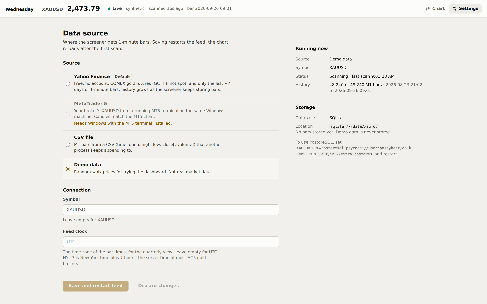
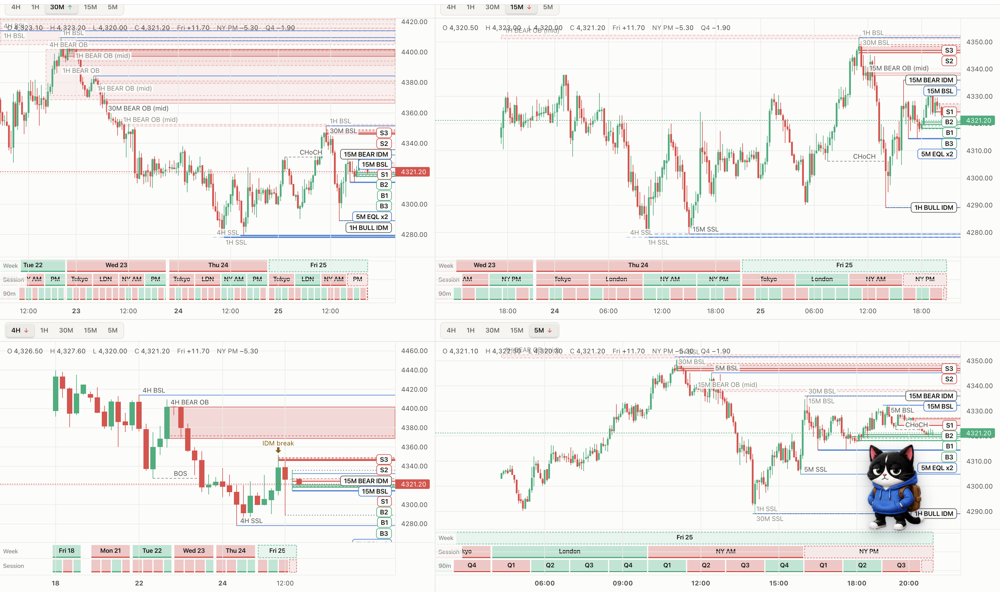

<div align="center">

# Wednesday

<sub>part of momentum.id</sub>

<p><i>"We're counting candles, not gambling. We follow a very specific set of rules and run a system.<br>
I've seen how crazy people get at those tables. Sometimes you lose control.<br>
They follow their emotions. And you will not!"</i><br>
<sub>— Prof. Micky Rosa, MIT, <i>21</i> (2008)</sub></p>

**Smart Money Concepts screener for XAUUSD.**<br>
Order blocks, liquidity and inducement across 4H → 5M, with ranked limit setups and Telegram alerts.

<p>
  
  
  
  
  
  <br>
  
  
  
</p>

<p>
  <a href="#quick-start">Quick start</a> ·
  <a href="docs/detectors.md">Strategy</a> ·
  <a href="docs/dashboard.md">Dashboard</a> ·
  <a href="docs/alerts.md">Alerts</a> ·
  <a href="docs/README.md">All docs</a>
</p>

<picture>
  <source media="(prefers-color-scheme: light)" srcset="docs/images/dashboard-light.png">
  
</picture>

</div>

## What it does

- **Scans every minute**: 1-minute bars become 4H, 1H, 30M, 15M and 5M candles, scanned from the highest timeframe down.
- **Finds the nearest levels** above and below price: order blocks (extreme and mid), BSL / SSL with equal highs and lows, and inducement.
- **Ranks limit setups**: entry on the order block's body, stop on the opposite edge capped at 3.00, extreme first, then nearest.
- **Maps everything to the chart**: every setup and level in the ladder is pinned on the chart under the same tag.
- **Full screen with 1, 2 or 4 charts**, TradingView style: each on its own timeframe, crosshairs linked, panes resizable by dragging.
- **Quarterly theory pane** under the chart: every weekday, session (Tokyo, London, NY AM, NY PM) and 90-minute quarter as a green or red block, plus how often each one closed green.
- **Your bias steers the list**: set bullish, bearish or neutral by hand; setups get RISK ON / RISK OFF labels, sells at a lower high (or buys at a higher low) come first, and neutral marks everything no trade.
- **News brief**: Claude or OpenAI reads the news pages you pick and suggests a bias you can apply with one click.
- **Pings you on Telegram** when price trades into an order block.
- **Free data by default** (Yahoo Finance), MetaTrader 5 when you're ready; history stored in SQLite or PostgreSQL.

<table>
  <tr>
    <td width="50%"></td>
    <td width="50%"></td>
  </tr>
  <tr>
    <td align="center"><sub>Hover a setup to find it on the chart</sub></td>
    <td align="center"><sub>Switch data source live, set up alerts</sub></td>
  </tr>
</table>

### Multiple timeframes at once

Full screen, split into two or four charts. Hover one and the others follow to the same moment on their own timeframe; drag the lines between charts to resize.

<picture>
  <source media="(prefers-color-scheme: light)" srcset="docs/images/fullscreen-2.png">
  
</picture>



> **Why "Wednesday"?** Watching gold through quarterly theory, the Wednesday and New York blocks kept coming up green. The quarterly pane shows those blocks on the chart and its stats count how often that holds.

## Quick start

Needs [uv](https://docs.astral.sh/uv/) and Node 20+.

```bash
git clone https://github.com/mragungsetiaji/wednesday.git
cd wednesday
make setup     # checks uv + Node, creates .env, installs everything, builds the dashboard
make serve     # dashboard on http://127.0.0.1:8000 (Yahoo Finance data)
```

Just want to look around? `make demo` runs the same dashboard on random demo data.

```bash
make dev       # API + Vite hot reload on http://localhost:5173
make scan      # one scan in the console
make test      # run the tests
make           # list every target
```

Extra flags go through `ARGS`, e.g. `make serve PORT=9000 ARGS="--lookback 300"`.

**Windows / MT5**: run the `uv` commands directly, see [Windows and VPS](docs/deploy-windows.md).

```powershell
uv sync --extra mt5 --extra llm
uv run wednesday --source mt5 --check   # test the MT5 connection
uv run wednesday --serve
```

## Docs

| | |
| --- | --- |
| [Detectors and the limit strategy](docs/detectors.md) | How order blocks, liquidity and inducement are found, and how setups are ranked |
| [Dashboard](docs/dashboard.md) | Chart, level ladder, quarterly pane, panels |
| [Data sources and storage](docs/data-sources.md) | Yahoo Finance, MT5, CSV, SQLite / PostgreSQL |
| [Bias and news brief](docs/bias.md) | Setting a bias, risk on / off labels, the LLM news brief |
| [Telegram alerts](docs/alerts.md) | Bot setup and when alerts fire |
| [Configuration](docs/configuration.md) | Make targets, CLI options, `.env` |
| [Windows and VPS](docs/deploy-windows.md) | Running 24/7 next to an MT5 terminal |
| [Development](docs/development.md) | Project layout and how a scan flows |

> [!NOTE]
> Wednesday is an analysis tool. It doesn't place orders, and nothing it shows is financial advice.
