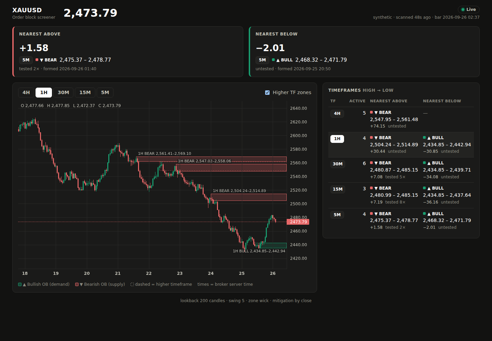

# xau-screener

Order block screener for XAUUSD. Every minute it pulls closed 1-minute bars,
resamples them into **4H, 1H, 30M, 15M and 5M** candles, detects order blocks
over the last N candles of each timeframe, and reports the **nearest active
order block above and below** the current price, scanning from the highest
timeframe down to the lowest.

```
[2026-09-24 14:05] XAUUSD price 2651.40
TF    #OB  NEAREST ABOVE                          NEAREST BELOW                          INSIDE
4H      3  BEAR 2662.10-2668.35 (+10.70) t0       BULL 2631.80-2637.25 (-14.15) t1       -
1H      5  BEAR 2655.90-2659.00 (+4.50) t2        BULL 2643.10-2646.70 (-4.70) t0        -
...
nearest above: 1H BEAR 2655.90-2659.00 (+4.50) t0 | nearest below: 15M BULL ...
```

`(+4.50)` is the distance from price to the zone's nearest edge, `tN` is how many
candles have tapped the zone since it formed, and `INSIDE` lists zones price is
currently trading in.

## Setup (uv)

```bash
uv sync                      # core deps (pandas, numpy) + dev tools
uv sync --extra mt5          # MetaTrader 5 feed (Windows only)
uv sync --extra yfinance     # Yahoo Finance feed (testing / non-Windows)
```

## Run

```bash
# MetaTrader 5 terminal must be running and logged in
uv run xau-screener --source mt5 --symbol XAUUSD

# Other feeds
uv run xau-screener --source yfinance            # GC=F futures, ~7 days of 1m only
uv run xau-screener --source csv --csv data/xauusd_m1.csv
uv run xau-screener --source synthetic --once    # random-walk demo, no data needed
```

## Web dashboard (React)



```bash
cd web && npm install && npm run build && cd ..   # once, and after UI changes (needs Node 20+)
uv run xau-screener --serve                        # scan loop + dashboard on http://127.0.0.1:8000
```

The dashboard shows the live price, the nearest order block above and below
across all timeframes, a table per timeframe (4H down to 5M), and a candlestick
chart with the active order blocks drawn as zones (optionally with the higher
timeframe zones dashed on top). It refreshes itself every few seconds; the
server rescans once a minute. API docs: `http://127.0.0.1:8000/api/docs`.

For UI development, run the server and the Vite dev server side by side:

```bash
uv run xau-screener --source synthetic --serve
cd web && npm run dev        # http://localhost:5173, proxies /api to :8000
```

The dashboard has no login. It binds to `127.0.0.1` by default; see
[docs/DEPLOY_WINDOWS.md](docs/DEPLOY_WINDOWS.md) for reaching it on a VPS.

## MT5 and options

For MT5, test the connection first with `uv run xau-screener --check`.
Settings can live in a `.env` file (copy `.env.example`); command line flags
override it. Windows local testing and VPS production setup (auto-start,
auto-restart, logs) are in [docs/DEPLOY_WINDOWS.md](docs/DEPLOY_WINDOWS.md).

Useful options:

| Option | Default | Meaning |
| --- | --- | --- |
| `--timeframes` | `4H,1H,30M,15M,5M` | Timeframes to scan (always processed high to low) |
| `--lookback` | `200` | Closed candles per timeframe searched for order blocks |
| `--swing-length` | `5` | Bars on each side needed to confirm a swing high/low |
| `--zone` | `wick` | OB zone = full candle range (`wick`) or open/close (`body`) |
| `--mitigation` | `close` | OB is invalidated by a close through it (`close`) or any wick (`wick`) |
| `--once` | off | Scan once and exit instead of looping every minute |
| `--serve` | off | Also run the web dashboard + API (`XAU_SERVE=1`) |
| `--host` / `--port` | `127.0.0.1` / `8000` | Dashboard address (`XAU_HOST`, `XAU_PORT`) |
| `--check` | off | Test the feed connection (account, symbol, bars loaded) and exit |
| `--log-file` | - | Rotating log file, includes every scan table (`XAU_LOG_FILE`) |
| `--json-out` | - | Append each scan as a JSON line (for bots/dashboards) |
| `--delay` | `2` | Seconds after the minute closes before polling |

The 4H timeframe with `--lookback 200` needs about 48k M1 bars, which are loaded
once at startup; after that only the last 30 bars are fetched each minute.

## How order blocks are detected

1. **Swings**: a swing high/low is a bar whose high/low is the extreme of the
   `swing_length` bars on each side. It is only confirmed after those right-side
   bars close, so there is no look-ahead.
2. **Break of structure**: a candle *closes* above the latest unbroken swing
   high (bullish) or below the latest unbroken swing low (bearish).
3. **Order block**: for a bullish break, the candle with the lowest low between
   the swing high and the breakout candle (demand zone). For a bearish break,
   the candle with the highest high in that leg (supply zone).
4. **Mitigation**: a bullish OB dies when price closes below its bottom, a
   bearish OB when price closes above its top. Only unmitigated OBs are reported.

Only closed candles are used for detection; the still-forming candle of each
timeframe is dropped. Candle times follow the feed's clock, so with MT5 the 4H
candles line up with the broker chart.

## Project layout

```
src/xau_screener/
  timeframes.py   timeframe list + M1 -> HTF resampling
  orderblock.py   swing / BOS / order block detection
  feeds.py        MT5, yfinance, CSV, synthetic feeds + rolling M1 buffer
  scanner.py      multi-timeframe scan, nearest OB above/below
  report.py       console table
  engine.py       scan loop shared by the console and the web server
  server.py       FastAPI: /api/scan, /api/candles, serves the built dashboard
  cli.py          command line entry point
web/              React + Vite + TypeScript dashboard (lightweight-charts)
scripts/          Windows VPS: auto-restart wrapper + Task Scheduler installer
docs/             deployment guide
tests/
```

Add a new data source by subclassing `feeds.DataFeed` and implementing
`fetch_m1(count)` (return closed M1 bars, oldest first).

## Tests

```bash
uv run pytest
```
