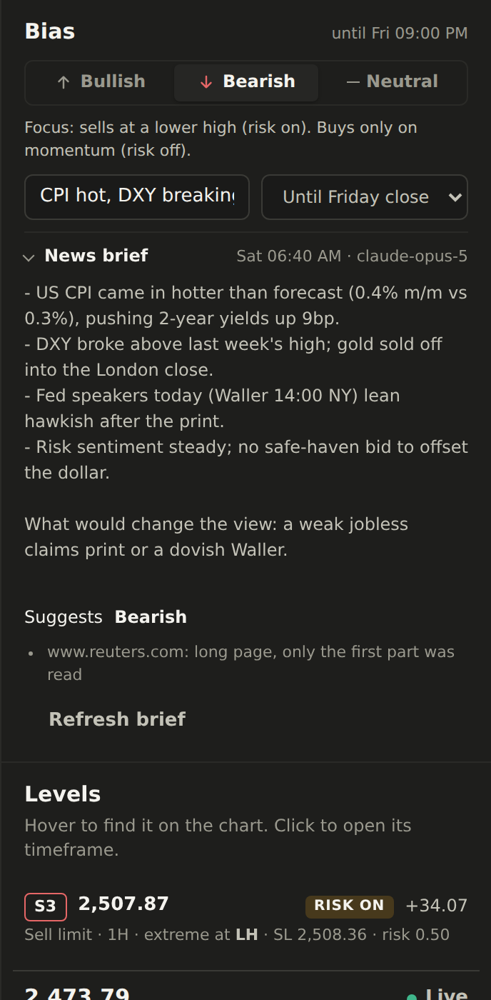
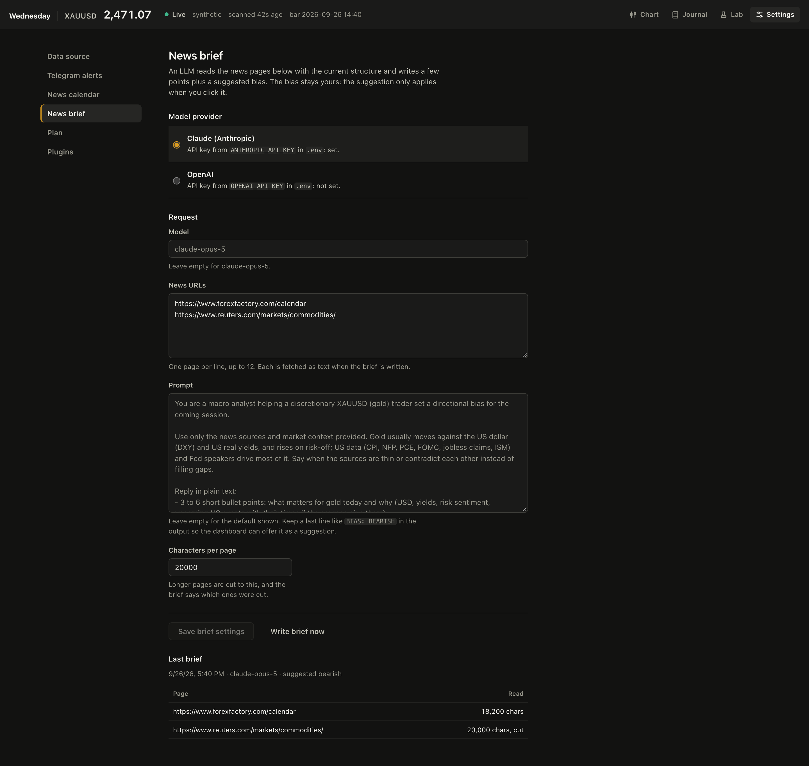

# Bias and news brief

Wednesday doesn't score the news. You read it (with help from the brief) and set
a **bias** by hand; the bias then labels the setups so you know where to focus.
Both directions stay on the list: momentum trades against the bias are still
there, just marked for a smaller risk.

## Setting the bias

At the top of the panel next to the chart:

| Bias | Risk on (focus) | Risk off (still listed) |
| --- | --- | --- |
| **Bearish** | Sells, preferably at a **lower high** order block | Buys, on momentum |
| **Bullish** | Buys, preferably at a **higher low** order block | Sells, on momentum |
| **Neutral** | Nothing: every setup is marked **No trade** and Telegram alerts pause | |

- Add a short note on why (it shows in the pill on the full screen charts).
- Pick how long it holds: until the **New York close** (17:00 NY), until
  **Friday's close**, or **until changed**. Once it runs out, the panel says so and
  the labels go away until you set it again.
- The bias is saved in the database, so it survives restarts.

## What the bias changes

- **Labels** on the S / B setups in the ladder: `RISK ON`, `RISK OFF` or `NO TRADE`.
- **Order** on the favoured side: order blocks at a lower high (bearish) or higher
  low (bullish) come first, then the usual extreme-first, nearest-first order.
  The ladder still reads like the price axis, highest first.
- **Telegram alerts** end with the label, e.g. `RISK ON (with bearish bias)`. With
  a neutral bias they pause, unless *Alert with a neutral bias too* is ticked in
  Settings.
- The console output and `--json-out` carry the same labels.

Nothing is filtered out. The swing tags (`LH`, `HH`, `HL`, `LL`) are explained in
[detectors.md](detectors.md#swing-tag).

## News brief (LLM)

The brief reads news pages you choose, adds the current price and structure per
timeframe, and asks Claude or OpenAI for a few points plus a closing line such as
`BIAS: BEARISH`. That line shows as **Suggests bearish · Use it**: one click
applies it, nothing changes on its own.

### Setup

1. `make install` (or `uv sync --extra llm`) installs both SDKs.
2. In **Settings > News brief** pick the provider and paste its API key. The key
   is kept in the system credential store (Windows Credential Manager), never in
   the database; `ANTHROPIC_API_KEY` / `OPENAI_API_KEY` in `.env` still work as a
   fallback.
3. Pick optionally a model (default
   `claude-opus-5` for Claude, `gpt-5` for OpenAI), and add up to 12 news URLs,
   one per line: an economic calendar, a gold or FX news page, a Fed page.
4. Optionally write your own prompt. Keep the last line `BIAS: ...` in the
   output so the dashboard can offer it as a suggestion.
5. **Write brief now** in Settings, or **Write brief** / **Refresh brief** in the
   panel. It runs in the background and shows up in the panel.

### How pages are read

Each URL is fetched as plain text (scripts, navigation and styles dropped). Pages
longer than *Characters per page* (default 20,000) are cut to that; the brief and
the settings page say which pages were cut or couldn't be read. Pages that need a
login or render with JavaScript only may come back empty; pick pages that show
their text in the HTML.

With Claude Opus 5 the request opts into server-side fallbacks, so if the model
declines, another Claude model answers in the same call.

A page whose text hasn't changed since the last brief is sent cut to its first
1,500 characters, together with that last brief, instead of in full. The fixed
system prompt carries a prompt-cache mark for Claude; OpenAI caches repeated
prompt starts on its own. Cached input is billed at a fraction of the normal
price and shows in the usage log as *Cached*.

### Cost and the monthly budget

Every LLM call is logged with its feature (`brief`, or a plugin's, like `recap`),
provider, model and tokens. The token counts are the ones in the provider's
response; only a reply without them is estimated (about four characters a token)
and marked *est.* **Settings > LLM usage** shows this month's spend by feature and
by model, the last 30 days by day (with a table view) and the most expensive
calls.

The cost comes from the price table on the same page, in US dollars per million
tokens (input, output, cache read, cache write). A few models come filled in;
check them against your provider's pricing page and add the models you use. A
model without a price is logged with no cost, and the page says the budget can't
count it.

Set a **monthly budget** (US dollars, per UTC calendar month) to bound the spend.
At 80% the page and the bias panel warn. At 100% the server refuses scheduled LLM
jobs, and a manual brief asks you first (`POST /api/brief/generate` answers 409
until it's sent with `{"confirm_over_budget": true}`). The check runs on the
server before the call, so no client can skip it.
