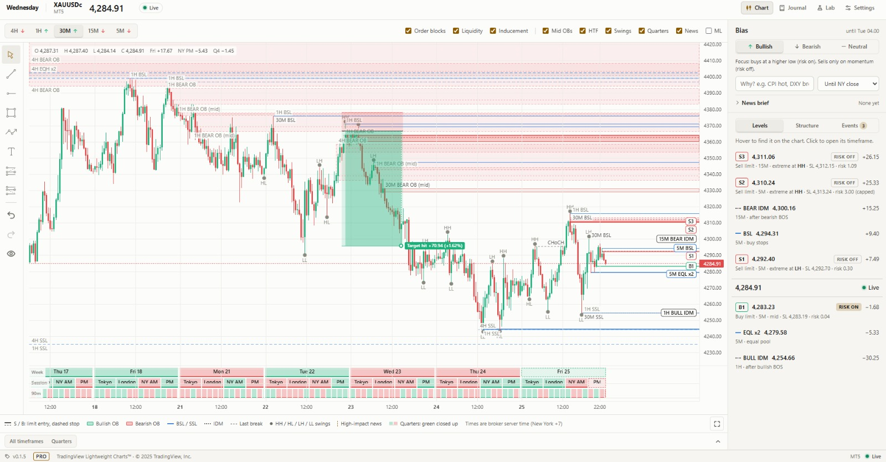
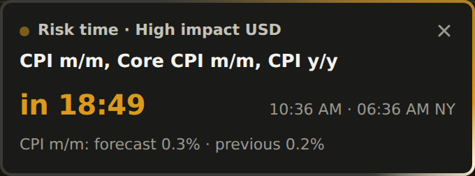
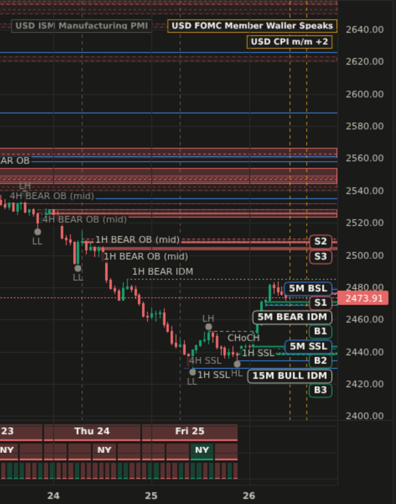
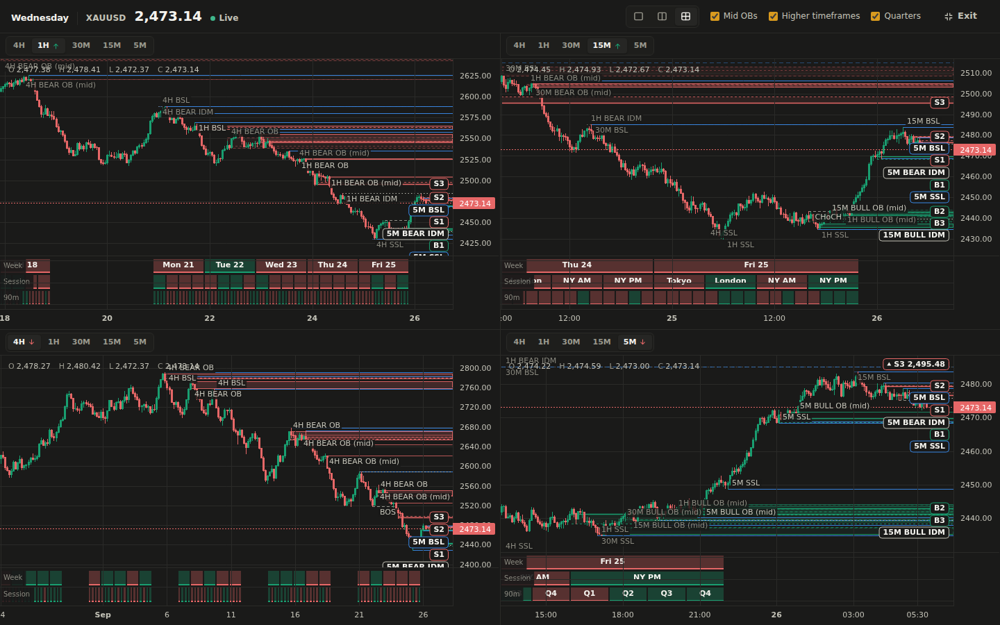
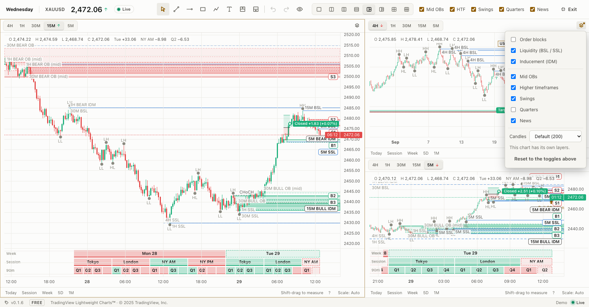
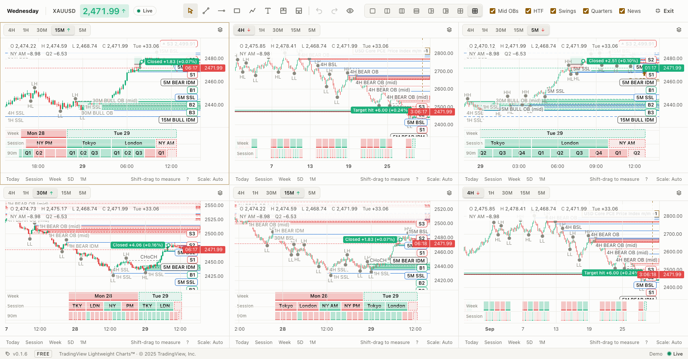
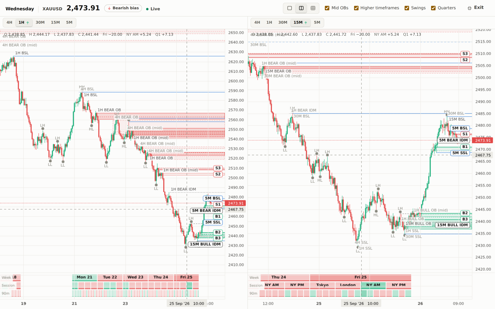
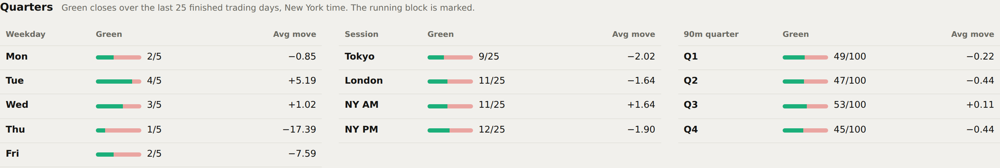
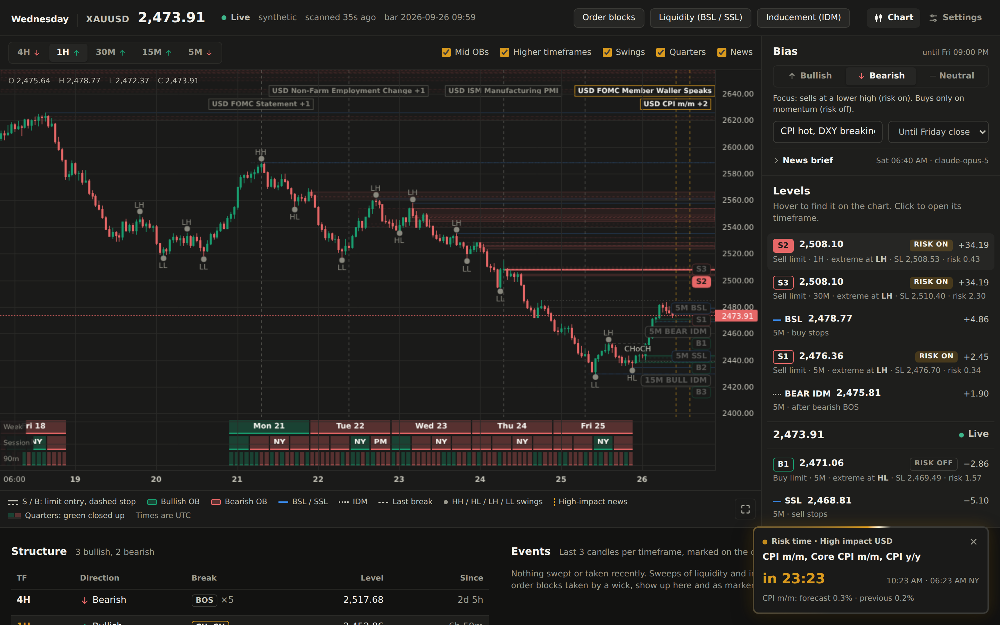
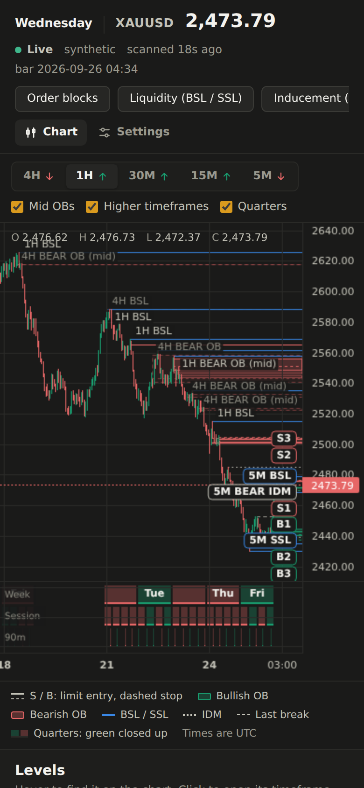

# Dashboard

```bash
make serve          # or: uv run wednesday --serve
```

Opens on http://127.0.0.1:8000. It refreshes every few seconds; the server
rescans once a minute. API docs live at `/api/docs`.



## Chart first

The chart shows the selected timeframe's candles with everything the detectors
found on it:

- **Order blocks** as boxes; mid OBs are lighter than extreme OBs.
- **Liquidity** (BSL / SSL, EQH / EQL) and **inducement** as lines.
- **Higher-timeframe levels**, faded, so you see where a 5M setup sits inside the 1H picture.
- The **latest break of structure** (BOS / CHoCH) as a dashed segment.
- **Swing labels**: `HH` / `LH` above swing highs and `HL` / `LL` below swing
  lows, so the structure reads at a glance.
- **Recent sweeps** as markers on the candle that swept.

The timeframe tabs carry each timeframe's structure direction (↑ / ↓). Beside
them, the detectors (**Order blocks**, **Liquidity**, **Inducement**) and the
overlays (**Mid OBs**, **HTF**, **Swings**, **Quarters**, **News**, **ML**) switch on and off.

The header price follows the [live price](data-sources.md#live-price): each tick
flashes green or red, and the arrow keeps the last direction.

### Moving around the chart

A bar under each chart (the main one and every full screen pane) holds:

- **Time range presets**: **Today** (the trading day, from 18:00 New York),
  **Session** (the current Tokyo, London, NY AM or NY PM window), **Week** (from
  Sunday 18:00 New York), **5D** (the last five trading days) and **1M**. They
  come from the same New York blocks as the [quarterly pane](#quarterly-theory-pane),
  so they land on the right candles whatever the feed clock. Older candles load
  when the range starts before the first one on the chart.
- **Scale**: **Price** (auto, the default), **Log**, or **% from session open**
  (the price axis in percent from the current session's open). **Lock range**
  keeps the price range the chart has now, so a spike, a new tick or a scan
  doesn't rescale it, until you unlock it. **Invert** flips the chart upside down,
  to check a bias the other way. **Reset** goes back to auto.

**Shift-drag** on the chart measures a move: the price change, in % and in pips,
and how many bars and how long it spans. It goes away when you let go. A pip is
ten of the symbol's points as the MT5 terminal reports them (0.1 on a two-digit
gold); without MT5 it's the symbol's usual size (0.1 on gold, 0.01 on yen pairs
and silver).

When you scroll back and the live candle leaves the screen, a **Live** button
at the bottom right brings it back.

The time left on the forming candle counts down beside the price label, for the
chart's timeframe.

### Keyboard shortcuts

During the NY open your hands stay on MT5; the chart takes keys too. None of them
fire while you're typing in a field, and **?** (or the **?** under a chart) lists
them.

| Keys | Action |
| --- | --- |
| `5`, `15`, `1h`, `4h` … then Enter | Switch the focused chart's timeframe (Esc cancels) |
| Alt+1 … Alt+6 | Focus chart 1 to 6 in full screen (it gets a thin outline; clicking a chart focuses it too) |
| Alt+R | Reset the zoom and scroll to the live candle |
| Alt+G | Go to a date and time: "last Wednesday 09:30", "yesterday 8pm", "24 Sep 3:15pm", "2026-09-24 14:00" |
| Alt+H / Alt+T / Alt+B | Horizontal line / trendline / rectangle tool |
| F | Full screen on and off |
| ? | The shortcut list |
| Shift+drag | Measure a move |
| Enter | Finish a path |
| Esc | Cancel the tool or the selection; leave full screen |
| Delete | Delete the selected drawing |
| Ctrl+Z (⌘Z) | Undo a drawing change |
| Ctrl+Shift+Z, Ctrl+Y (⌘⇧Z) | Redo |

Go to reads times in **New York** time by default, or on the **feed** clock (the
chart's own times); end the text with "NY" or "feed" to pick one. A New York time
goes through the server, which converts it with the feed clock's offset on that
date, so a date across a DST change still lands on the right candle. A weekday is
the latest one (today counts); "last" skips today. When the date is older than the
loaded candles, older ones load first.

## Drawings

The column left of the chart holds drawing tools, TradingView style:

- **Trendline**: click two points, or press and drag.
- **Horizontal line**: click a price; its price shows at the right edge.
- **Rectangle**: click two corners, or press and drag.
- **Path**: click each point; click the last point again, double-click or press
  Enter to finish (Esc drops it).
- **Text**: click where it goes, then type in the field that opens.
- **Long / short position**: click the entry. It starts with the stop 40 px away,
  the target at 2R and 20 candles wide; drag the handles on its left edge to set
  the entry, stop and target, and the one on the entry line's right end to set how
  long it runs. The stop and target stay on their own side of the entry. Hover or
  select the position to see the prices, the distance to each, the R:R and, with
  [position sizing](risk.md) set up in **Settings > Risk** (or read from MT5),
  the lot size and the money at risk and to gain, sized the same way as the
  ladder's setups.

  The position also follows price, live ticks included. Like a limit order, it
  fills on the first candle from its start that reaches the entry (until then
  the entry label says *waiting for entry*, and a box that ends unfilled fades).
  Once filled, the area from the entry to the current price is shaded green in
  profit and red in loss, with a label: **Open**, then **Target hit** or **Stop
  hit** at the first candle that reaches one, or **Closed** at the close where
  the box ends. On the fill candle itself only its close counts, and a candle
  reaching both levels counts as the stop. It works on the candles of the chart
  you are looking at, so a higher timeframe can resolve a close call differently.

Points snap to the candle under the pointer. With the cursor, click a drawing to
select it, drag it to move it, or drag a handle to reshape it; double-click a text
to edit it. A bar above the chart styles the selected drawing: color, line width,
solid, dashed or dotted line, a text's words and size, plus **Lock** (it can't be
moved or deleted) and **Delete** (or the Delete key).

Below the tools, **Undo** and **Redo** (Ctrl+Z, Ctrl+Shift+Z or Ctrl+Y; Cmd on a
Mac) step back through the last 100 changes; a drag counts as one. The eye hides
or shows every drawing, and Esc cancels a tool or the selection.

Drawings are anchored to time and price, not pixels, so one drawing shows on
every timeframe and in full screen: a position from 10:00 to 11:00 is 12 candles
wide on 5M, 4 on 15M and one on 1H. Time past the last candle runs at the
timeframe's length, and moving a drawing shifts it by whole candles of time, so
it keeps its duration across the daily break or a weekend. They are saved in the database per data
source and symbol (MT5 times are the broker's clock, and Yahoo's `GC=F` isn't
spot XAUUSD), in the `drawings` table.

## Risk-time news card

An hour before high-impact news (USD by default), a card appears in the bottom
right with the release, a countdown, the time in your zone and in New York, and
the forecast and previous figure. Releases at the same minute (CPI m/m, core,
y/y) share one card.

- **Last 30 minutes**: a light runs around the card's edge and the countdown turns
  amber. With reduced motion on, the edge turns solid amber instead.
- **Released**: the card stays for 10 minutes with how long ago it came out.
- **Close (×)**: during the first half hour it only snoozes until the 30-minute
  mark; after that it hides for that release. It also shows over the full
  screen charts.



The same releases are drawn on every chart as dashed vertical lines with their
name at the top: amber for what's ahead (and the last 10 minutes), grey for what
already came out this week. Upcoming ones get label space first; switch them off
with **News** above the chart. Times are converted to the feed clock, so the
lines match the candles with MT5 broker time too.



The calendar comes from ForexFactory's free weekly feed, fetched at most once an
hour and kept in the database. **Settings > News calendar** picks the currencies
and impact levels and lists what's coming this week.

## Full screen and multiple charts

The button at the bottom right of the chart (or **F**) opens the charts full
screen, TradingView style. Pick a layout at the top:

- **one chart**, **two side by side**, **three columns** or **three rows**;
- **one big chart with two or three stacked beside it**, for an execution chart
  next to its higher timeframes;
- **four in a 2 × 2 grid**, or **six in 3 columns × 2 rows** for an ultrawide
  monitor.

Each chart has its own timeframe tabs; the first one follows the dashboard's
timeframe, the others are remembered in this browser, as is the layout. The
toggles at the top (Mid OBs, HTF, Swings, Quarters, News) switch for every chart
at once. **Esc** or **Exit** goes back. On a phone the charts stack and scroll.

- **Per-chart layers**: the layers button at the right of a chart's tabs gives
  that chart its own detectors, overlays and candle count (more candles for a 4H
  chart that should show weeks, fewer for a 1M one). It follows the toggles at the
  top until you change something in it; then a dot marks it, and **Reset to the
  toggles above** hands it back. Each chart's choices are remembered by its place
  (chart 1, chart 2 …), so they survive switching layouts as long as the layout
  still has that chart.
- **Linked crosshairs**: hovering one chart moves the crosshair of the others to
  the candle that contains the same moment on their timeframe (and the same
  price), and their OHLC and quarter readouts follow. A chart whose candles
  don't reach back that far just hides its crosshair.
- **Resizable panes**: drag a line between charts; each line moves only the two
  charts beside it. Arrow keys move a focused line (Shift for bigger steps), and
  double-click shares the two evenly. Every layout remembers its own sizes.









## Quarterly theory pane

Under the candles, a pane splits time the way quarterly theory does, in New
York hours with the trading day starting at 18:00 NY:

| Row | Blocks |
| --- | --- |
| Week | Mon (Q1), Tue (Q2), Wed (Q3), Thu (Q4), Fri |
| Session | Tokyo 18:00, London 00:00, NY AM 06:00, NY PM 12:00 (New York time) |
| 90m | each session in four 90-minute quarters, Q1–Q4 (hidden on 4H, too thin) |

A block is **green** when that period closed above its open and **red** when it
closed below. The running block is outlined only. Hovering the chart adds the
week, session and 90m move under the cursor to the readout at the top left.
Switch the pane off with **Quarters** above the chart.

The **Quarters** panel below the chart counts how often each weekday, session and
90-minute quarter closed green, with the average move, over the stored history
(the running block excluded). The history grows as the screener keeps storing
bars, so the counts get more meaningful over time.



The blocks need to know what clock the bar times are in: see
[Feed clock](data-sources.md#feed-clock).

## Model layer (ML)

**ML** above the chart shows the active model from the [Lab](lab.md): each block
the model finds on the chart's timeframe, as a dashed outline with its
probability, and a **Model** tab under the chart listing them with ✓ / ✕
to mark them valid or invalid. Without an active model the panel links to the Lab.

## Level ladder

Beside the chart, the **Levels** ladder lists what matters around price in the
same vertical order as the price axis:

- sell limit setups `S1`–`S3` (extreme first, then nearest) and the nearest
  liquidity and IDM above price,
- the live price,
- buy limit setups `B1`–`B3` and the levels below.

Every row is pinned on the chart under the same tag: setups as an entry line
with a dashed stop, levels as lines. Hovering a row highlights it on the chart
and dims the rest. A level outside the visible range docks to the chart edge
with its price. Clicking a row opens its timeframe.



## Panels

The rail beside the chart keeps the bias on top and tabs under it:

- **Levels**: the ladder above.
- **Structure**: direction, last break (BOS / CHoCH, with the streak), its level and age, per timeframe.
- **Events**: levels swept or taken in the last few candles of each timeframe; the tab counts them.

Under the chart, a dock opens with its tabs (drag its top edge to resize, click
the open tab again to close it):

- **All timeframes**: the nearest level above and below per detector and timeframe.
- **Quarters**: how often each weekday, session and 90-minute quarter closed green.
- **Distribution**: how unusual the current move is (below).
- **Model**: the active model's blocks, when **ML** is on.

### Move distribution

The **Distribution** tab puts the current day, week, session or 90-minute block
against the same periods in the past, as a histogram with the current one marked.

- **Measure**: the change in % (close to the previous close for a day or week,
  open to close for a session or block), the range (high minus low) in % of the
  open, or the range in daily ATR(14), taken from the 14 days *before* that day.
- **Lookback**: 1 year, 5 years or all the history there is. **Same weekday**
  compares a Wednesday only with Wednesdays; **Same session** compares NY AM only
  with NY AM (for 90-minute blocks, the same quarter of the same session).
- Periods follow New York time, like the quarters pane: the trading day starts
  18:00 New York the evening before, so boundaries stay put through DST whatever
  the feed's clock. Only closed periods are samples; the current one is the
  marker, "so far" while it runs.

The headline gives the **percentile** first ("−1.80% so far: lower than 97.1% of
252 days, about 1 in 34") and the z-score second. Gold's moves have fat tails:
big days happen more often than a normal curve says, so a z-score read as a
probability understates them, while the percentile just counts past periods. Tick
**Normal curve** to see the gap. Under 30 samples neither number is shown, only
the move and the sample count.

**Periods like this** lists up to 20 past periods that moved at least as far, and
what the next one did: facts about the history, not a forecast or advice.

History: the stored M1 bars and the live window. Days and weeks reach further back
with the feed's daily bars when it has them: Yahoo's daily history, or MT5's D1
when the broker's clock is New York +7 (its daily candles then match the New York
day; on other clocks they don't, so they're left out). The tables are rebuilt at
most every 6 hours; the current period updates with every scan.

## Light theme and mobile

The dashboard follows the system theme and works down to phone width.

<p>
  
  
</p>

## Access

By default the dashboard has no login and binds to `127.0.0.1`; any other address
is refused unless the login is on or `--insecure` is passed. Set
`XAU_AUTH_PASSWORD` (or `XAU_AUTH_PASSWORD_HASH` from `wednesday --hash-password`)
to turn the login on, then reach it through an HTTPS proxy; see
[deploy-windows.md](deploy-windows.md#opening-it-from-a-phone-or-laptop-login--https).
**Settings > Access** logs out and makes API tokens for scripts.

## UI development

```bash
make dev    # API on :8000 + Vite with hot reload on http://localhost:5173
```

The UI is React 19 + TypeScript + Vite with
[lightweight-charts](https://github.com/tradingview/lightweight-charts) in `web/`.
`make ui` rebuilds `web/dist`, which the Python server serves.
