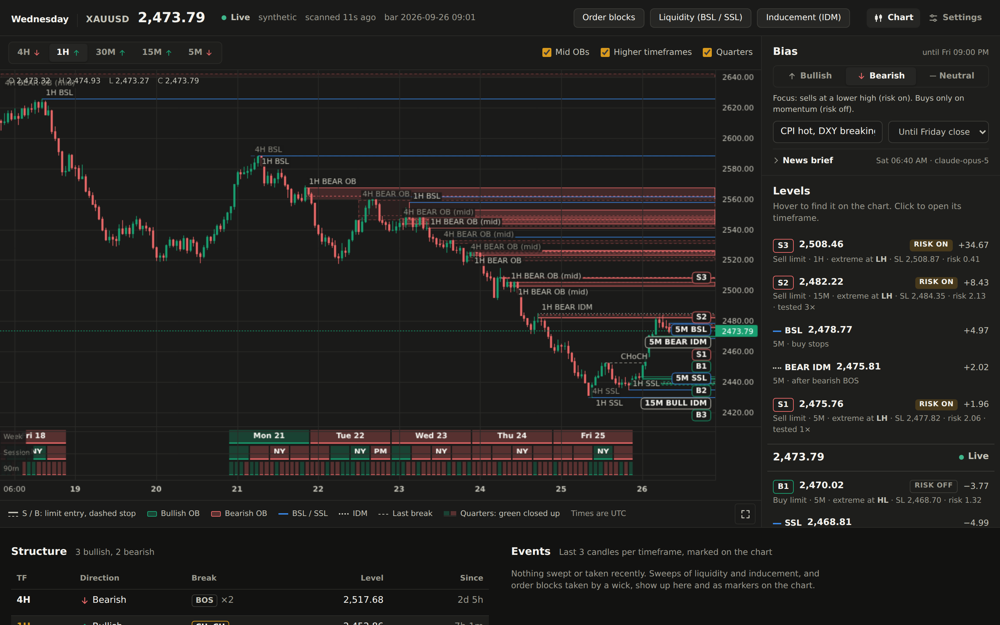
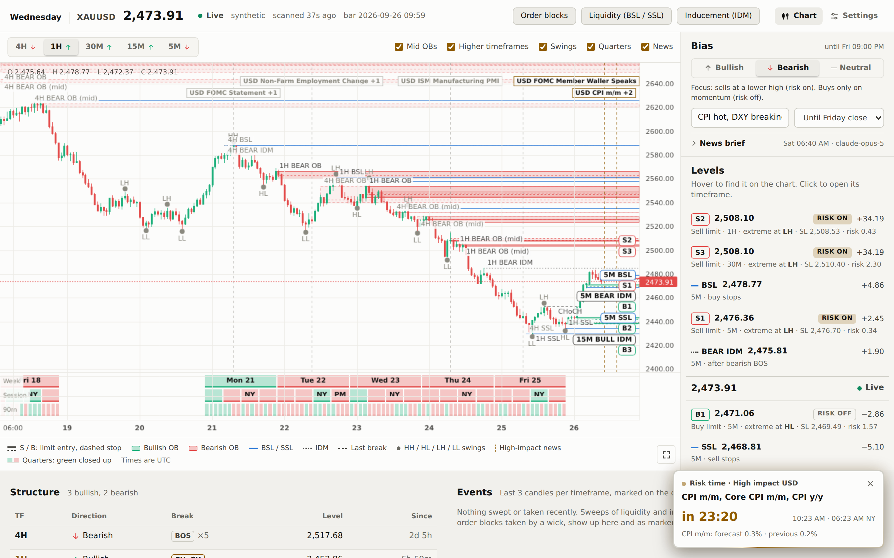

# Dashboard

```bash
make serve          # or: uv run wednesday --serve
```

Opens on http://127.0.0.1:8000. It refreshes every few seconds; the server
rescans once a minute. API docs live at `/api/docs`.



## Chart first

The chart shows the selected timeframe's candles with everything the detectors
found on it:

- **Order blocks** as boxes; mid OBs are lighter than extreme OBs.
- **Liquidity** (BSL / SSL, EQH / EQL) and **inducement** as lines.
- **Higher-timeframe levels**, faded, so you see where a 5M setup sits inside the 1H picture.
- The **latest break of structure** (BOS / CHoCH) as a dashed segment.
- **Recent sweeps** as markers on the candle that swept.

The timeframe tabs carry each timeframe's structure direction (↑ / ↓).
**Mid OBs** and **Higher timeframes** can be switched off above the chart, and
each detector can be hidden from the top bar.

## Quarterly theory pane

Under the candles, a pane splits time the way quarterly theory does, in New
York hours with the trading day starting at 18:00 NY:

| Row | Blocks |
| --- | --- |
| Week | Mon (Q1), Tue (Q2), Wed (Q3), Thu (Q4), Fri |
| Session | Tokyo 18:00, London 00:00, NY AM 06:00, NY PM 12:00 (New York time) |
| 90m | each session in four 90-minute quarters, Q1–Q4 (hidden on 4H, too thin) |

A block is **green** when that period closed above its open and **red** when it
closed below. The running block is outlined only. Hovering the chart adds the
week, session and 90m move under the cursor to the readout at the top left.
Switch the pane off with **Quarters** above the chart.

The **Quarters** panel below the chart counts how often each weekday, session and
90-minute quarter closed green, with the average move, over the stored history
(the running block excluded). The history grows as the screener keeps storing
bars, so the counts get more meaningful over time.


The blocks need to know what clock the bar times are in: see
[Feed clock](data-sources.md#feed-clock).

## Level ladder

Beside the chart, the **Levels** ladder lists what matters around price in the
same vertical order as the price axis:

- sell limit setups `S1`–`S3` (extreme first, then nearest) and the nearest
  liquidity and IDM above price,
- the live price,
- buy limit setups `B1`–`B3` and the levels below.

Every row is pinned on the chart under the same tag: setups as an entry line
with a dashed stop, levels as lines. Hovering a row highlights it on the chart
and dims the rest. A level outside the visible range docks to the chart edge
with its price. Clicking a row opens its timeframe.


## Below the chart

- **Structure**: direction, last break (BOS / CHoCH, with the streak), its level and age, per timeframe.
- **Events**: levels swept or taken in the last few candles of each timeframe.
- **All timeframes**: the nearest level above and below per detector and timeframe.

## Light theme and mobile

The dashboard follows the system theme and works down to phone width.

<p>
  
  
</p>

## Access

The dashboard has no login, so it binds to `127.0.0.1` by default. To reach it
on a VPS, use an SSH tunnel or RDP rather than opening the port; see
[deploy-windows.md](deploy-windows.md).

## UI development

```bash
make dev    # API on :8000 + Vite with hot reload on http://localhost:5173
```

The UI is React 19 + TypeScript + Vite with
[lightweight-charts](https://github.com/tradingview/lightweight-charts) in `web/`.
`make ui` rebuilds `web/dist`, which the Python server serves.
