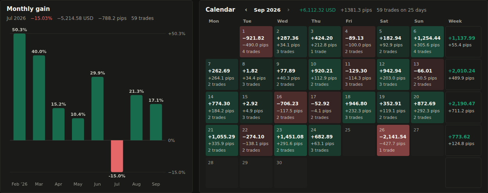

# Journal

The journal follows an MT5 account like a public track record (gain, drawdown,
deposits, the growth curve), but the drawdown can't be dressed up: it is rebuilt
from the price, minute by minute, instead of read off the closed results.

Open **Journal** in the top bar. It needs a database (the default SQLite one is fine).
One journal is free (the sample portfolio doesn't count); more than one (say, one
per account) needs the **Multiple journals** feature in your plan (Settings, Plan).

## The sample portfolio

On first start the journal holds a **Sample portfolio**: five months of made-up
XAUUSD trades (longs and shorts, winning and losing runs, some that sat deep in
loss before closing green), two deposits and a withdrawal. It shows every panel
filled before you hand over an account. The screenshots on this page are of it.

- It's marked **Sample data: not a real account** in the header and next to the
  gain and drawdown. No account, strategy or broker produced these numbers, and
  they say nothing about what trading returns.
- It doesn't count as a journal: with the free plan you keep it and still make
  one journal of your own.
- It can't be synced or imported into, and it has no MT5 account.
- **Delete…** next to it under Settings, Journal, Journals removes its trades and
  its prices. It stays deleted after a restart. To bring it back, **Show the
  sample** in the same place (or the link on the empty journal page).

The trades come from a generator with a fixed seed (`journal/sample.py`), so it
is the same on every install. It makes the M1 bars too, since the drawdown is
rebuilt from them: they are stored under the source `sample` (it shows under
Settings, Storage), and only the sample reads them. The scanner, the Lab and your
own journals never do. Every entry and exit price sits inside its minute's bar,
so the checks below pass the way they would for a real account.

## The header and Journal settings

The header holds the journal's name (a picker when there are several), one line
with the account, server and sync state ("Synced 2 min ago", "Waiting for account
51234567 in the terminal", "Last sync failed: …"), and a gear that opens
**Settings, Journal** (`#settings/journal`). Everything that sets up or manages a
journal lives there, saved field by field:

| Section | |
| --- | --- |
| This journal | Name; the MT5 account, server, company and currency from the last sync or import. |
| Sync | **Sync from MT5 automatically** (see below), the last sync and **Sync now**; **Import report**. |
| Display | **Show Saturday and Sunday in the calendar**, off by default. |
| Advanced | **Broker time offset (hours)**: leave empty to detect it from the deal prices. |
| Data | **Export trades (CSV)**. |
| Journals | Every journal with its account and last sync, **Open**, **Remove journal…**, and **New journal**. |

## Journals

A new journal takes a name and the MT5 account number (the login under
*Navigator*, *Accounts*). When the data source is MT5, the form fills in the
account the terminal is logged in to and **Create and sync** reads its history
straight away, with auto-sync on. For another account the journal starts empty:
log in to that account in the terminal and sync, or import its report. One
account has one journal; a second journal for the same number is refused.

Under **Journals** in Settings, Journal, the open one says *Current*. **Remove
journal…** asks first, then deletes its trades and notes from Wednesday and
changes nothing in MT5.

## Filling it

- **Sync from MT5 automatically** (one switch per journal, on for journals made
  from the terminal's account and for older journals filled from MT5) keeps the
  journal current with nothing to press. After each scan, on the scan thread
  (MT5 can only be used from the thread that connected it), it reads the deal
  count and open positions, and syncs only when they changed, once after the
  feed connects, and every 5 minutes while positions are open so their floating
  result stays current. A closed trade shows within about a minute. A terminal
  logged in to another account is waited for; a failure keeps the last good data
  and tries again after 1, 2, 4… minutes (at most 30). **Sync now** does it by hand.
  Wednesday reads the account number, server, company, currency, balance and
  equity; never the password or the account holder's name.
- **Import report**: in the terminal, *History* tab, right click, *Report*,
  *HTML*, with *All history* selected. The *Positions* table gives the trades, the
  *Deals* table the deposits and withdrawals. This works on any machine, so the
  dashboard doesn't have to run next to the terminal.

Both are local. Sync talks to the MT5 terminal running on the same Windows
machine as Wednesday (through the `MetaTrader5` package), and the report is a
file you upload. Wednesday never logs in to the broker itself and never sees an
investor password.

Either replaces the journal's trades, so sync or import the full history. A
journal belongs to one account: syncing while the terminal is logged in to a
different account, or importing another account's report, is refused.

From the terminal, a position closed in parts becomes one trade per closing
deal (with the average entry and the entry commission shared by volume); a
reversal (in/out) closes one trade and opens the other way. Positions still open
show with their floating result.

## The numbers

| | |
| --- | --- |
| Gain | Time-weighted: each closed trade grows the account by its result over the balance it was taken on, chained. A deposit isn't gain, a withdrawal isn't loss. |
| Abs. gain | Trading profit (with commission and swap) over everything deposited. |
| Daily, Monthly | The gain spread evenly over the days since the first deposit. |
| Drawdown | The deepest fall of the equity from its high, in the same time-weighted terms. See below. |
| Balance, Equity | Deposits, withdrawals and closed results; equity adds open trades at the last price. |
| Worst floating | The lowest the open trades were, together, in money. |

The numbers also include trades, win rate, profit factor, average win and loss, best and worst,
lots, commission, swap and the average hold. The trade list below is paged, newest first; click a trade for its note. **Export trades (CSV)**,
in Settings, Journal, gives every trade with its worst and best floating result,
whether it was checked, and your note.

Under the curve, one line says how the drawdown was worked out ("Drawdown from
closed results. Prices for 0 of 165 trades."), with **Details** for the full
check. Deal prices outside their bars, or a balance that doesn't match the
terminal, show in red with what to do.

## Monthly gain and the calendar

Under the curve, side by side: **Monthly gain** draws each month's gain as a bar from zero, green up and red
down, time-weighted like the total (so a deposit mid-month doesn't inflate it).
The line above the bars shows the latest month's gain, money, pips and number of
trades; hover or tab to a month to show that one instead.

The **calendar** shows a month of closed trades per day, by the day they closed
on the broker's clock: the result in money and pips, and how many trades. The
tint is green or red by the sign and stronger for bigger days (scaled to the
month's biggest). The last column adds up the week. It shows Monday to Friday:
weekend results still count in the week and the month, and the week cell names
them ("incl. Sat +145.60"). **Show Saturday and Sunday in the calendar** in
Settings, Journal brings the two columns back. On a phone the money is rounded.

**Pips** follow the usual journal convention: 0.1 on gold (a 1.00 move is 10
pips), 0.01 on yen pairs and silver, 0.0001 on other currency pairs. A trade's
pips don't depend on its size.

## Drawdown from the price

A statement only shows closed results. A trade that sat 50 points under water
and closed green looks like no drawdown at all. The journal rebuilds the equity
instead:

1. For every minute a trade was open, its floating result at that M1 bar's worst
   price: the low for a buy, the high for a sell. The entry and exit minutes
   count from the deal price on, since the bar also holds prices from before the
   entry or after the exit.
2. The open trades' results are added up at each minute, on top of the balance
   at that moment. When a trade closes while another is open, the other one's
   floating result counts at that moment too, so banking a winner next to a
   losing trade isn't a new high.
3. Drawdown is the largest fall from the highest point before it, time-weighted
   so deposits and withdrawals don't move it.

The money per point comes from the trades themselves (profit over the price move
and lots), so nothing about the contract has to be set. Gold with no closed trade
to learn from uses 100 per lot.

The **Balance** tab draws the balance as a step line and the equity at its lowest
in each hour; the **Drawdown** tab draws the fall from the high over time.

## What is checked

The box under the chart says how far the numbers are checked:

- **Rebuilt from prices**: the trades with M1 bars for their whole life. The
  bars are the ones Wednesday stored while running (the `m1_bars` table), matched
  by symbol: `XAUUSD.m`, `XAUUSDm`, `XAUUSD#` and `GOLD` are all XAUUSD, and bars
  from MT5 are preferred. Trades without bars count at their closed result, and the
  drawdown badge says **closed only** when none could be rebuilt.
- **Deal prices**: every entry and exit price has to sit inside its M1 bar (with
  0.03% to spare for the spread). A trade whose prices aren't in the market isn't
  used for the drawdown and is listed. That catches an edited report, or prices
  from a different feed than the bars.
- **Balance**: after a sync, the balance worked out from the deals against the
  balance the terminal reports.

The broker's deal clock and the price feed's clock can be hours apart. Unless
you set the offset (Broker time offset in Settings, Journal), the journal tries every
whole hour from −14 to +14 and uses the one where most deal prices fit their bars.
Bars from the same broker (the MT5 source) line up best; Yahoo's `GC=F` is
futures, priced differently from spot, so it won't match.

## Trades

The table lists closed time, symbol, side, result and pips first, then lots and
prices. **Worst** and **Checked** only show when a trade on the page has stored
prices, and **Note** when one has a note, tag or chart. On a phone the table keeps
the time, symbol, result and pips; the rest is in the opened row.

## Notes and reviews

Above the trades, **Notes and reviews** keeps what isn't a trade: a **note**
(what you see, what you're waiting for) or a **session review** (the plan, what
price did, what you did), with tags and a mood from 1 to 5. On the chart, the
book button beside a setup on the ladder (**Journal this**) adds that setup to
the open journal: its tag, timeframe, side, entry and stop.

Every entry keeps the market as it was when you wrote it: the price, your bias,
the nearest three setups each side, each timeframe's last break, and the next
high-impact releases. **Market then** under an entry shows it. It never changes
afterwards, so a review a week later sees what you saw, not today's scan.
Editing an entry changes its text, tags and mood only. Entries go with the
journal when it's removed, and the sample portfolio has none.

## Notes

Click a trade, or Tab to its close time and press Enter, to write a note and tags
(`a+ setup`, `fomo`, `moved stop`); Escape closes it. They
are kept by trade, survive a re-sync, and go into the CSV. They are the start of
what the second brain (#15) will read.

A trade can also hold chart pictures: under any chart, press the camera and
**Attach to a journal trade** (see [Chart snapshots](dashboard.md#chart-snapshots)).
They show above the note, open full size on a click, and the bin removes one. A
trade keeps up to 12; a camera and the count show in the Note column. The images
are PNG files in `data/snapshots/`, next to the database's `data/` folder and never
outside it; removing the picture or the journal deletes the files.

## Storage

`journals`, `journal_trades`, `journal_cash` and `journal_notes` in Wednesday's
database, and the chart pictures in `data/snapshots/`. The sample portfolio's bars
are in `m1_bars` under the source `sample`, and the setting `journal.sample`
remembers that it was deleted. Times are unix seconds of the broker's server clock, as MT5 reports
them. Nothing leaves the machine.
