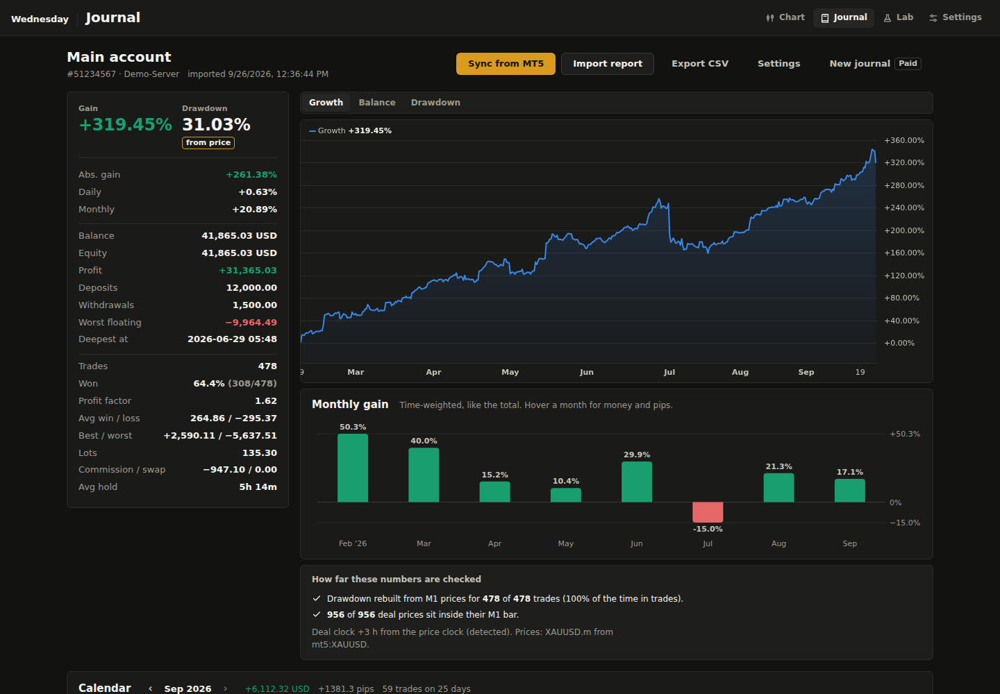
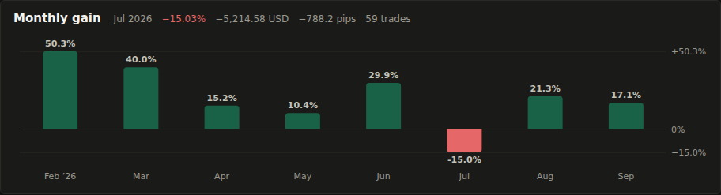
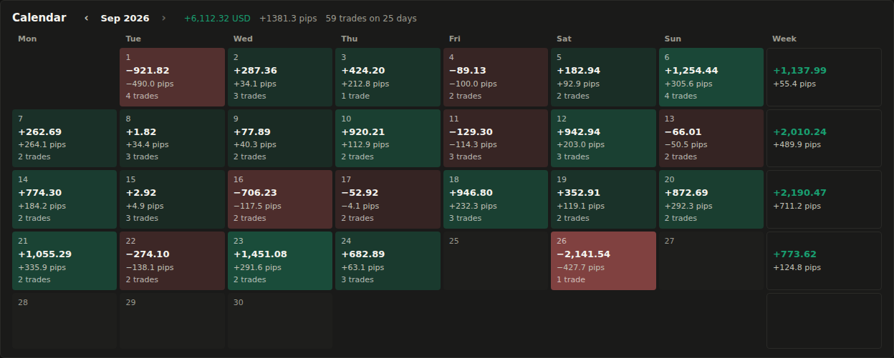
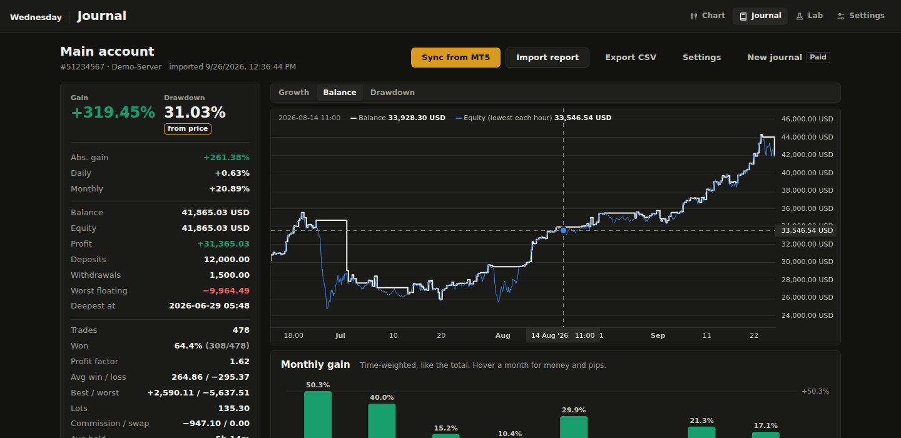

# Journal

The journal follows an MT5 account like a public track record (gain, drawdown,
deposits, the growth curve), but the drawdown can't be dressed up: it is rebuilt
from the price, minute by minute, instead of read off the closed results.

Open **Journal** in the top bar. It needs a database (the default SQLite one is fine).
One journal is free; more than one (say, one per account) needs the **Multiple
journals** feature in your plan (Settings, Plan).

## Filling it

- **Sync from MT5** reads every deal from the terminal the scanner is connected
  to, when the data source is MT5. It goes through the scan thread, since MT5 can
  only be used from the thread that connected it. Wednesday reads the account
  number, server, company, currency, balance and equity; never the password or the
  account holder's name.
- **Import report**: in the terminal, *History* tab, right click, *Report*,
  *HTML*, with *All history* selected. The *Positions* table gives the trades, the
  *Deals* table the deposits and withdrawals. This works on any machine, so the
  dashboard doesn't have to run next to the terminal.

Both are local. Sync talks to the MT5 terminal running on the same Windows
machine as Wednesday (through the `MetaTrader5` package), and the report is a
file you upload. Wednesday never logs in to the broker itself and never sees an
investor password.

Either replaces the journal's trades, so sync or import the full history. A
journal belongs to one account: syncing another account's history into it is
refused.

From the terminal, a position closed in parts becomes one trade per closing
deal (with the average entry and the entry commission shared by volume); a
reversal (in/out) closes one trade and opens the other way. Positions still open
show with their floating result.

## The numbers

| | |
| --- | --- |
| Gain | Time-weighted: each closed trade grows the account by its result over the balance it was taken on, chained. A deposit isn't gain, a withdrawal isn't loss. |
| Abs. gain | Trading profit (with commission and swap) over everything deposited. |
| Daily, Monthly | The gain spread evenly over the days since the first deposit. |
| Drawdown | The deepest fall of the equity from its high, in the same time-weighted terms. See below. |
| Balance, Equity | Deposits, withdrawals and closed results; equity adds open trades at the last price. |
| Worst floating | The lowest the open trades were, together, in money. |

Below: trades, win rate, profit factor, average win and loss, best and worst,
lots, commission, swap and the average hold. **Export CSV** gives every trade with
its worst and best floating result, whether it was checked, and your note.

## Monthly gain and the calendar

**Monthly gain** draws each month's gain as a bar from zero, green up and red
down, time-weighted like the total (so a deposit mid-month doesn't inflate it).
Hover a month for the money, pips and number of trades.

The **calendar** shows a month of closed trades per day, by the day they closed
on the broker's clock: the result in money and pips, and how many trades. The
tint is green or red by the sign and stronger for bigger days (scaled to the
month's biggest). The last column adds up the week. On a phone it shows the money
only, rounded.

**Pips** follow the usual journal convention: 0.1 on gold (a 1.00 move is 10
pips), 0.01 on yen pairs and silver, 0.0001 on other currency pairs. A trade's
pips don't depend on its size.

## Drawdown from the price

A statement only shows closed results. A trade that sat 50 points under water
and closed green looks like no drawdown at all. The journal rebuilds the equity
instead:

1. For every minute a trade was open, its floating result at that M1 bar's worst
   price: the low for a buy, the high for a sell. The entry and exit minutes
   count from the deal price on, since the bar also holds prices from before the
   entry or after the exit.
2. The open trades' results are added up at each minute, on top of the balance
   at that moment. When a trade closes while another is open, the other one's
   floating result counts at that moment too, so banking a winner next to a
   losing trade isn't a new high.
3. Drawdown is the largest fall from the highest point before it, time-weighted
   so deposits and withdrawals don't move it.

The money per point comes from the trades themselves (profit over the price move
and lots), so nothing about the contract has to be set. Gold with no closed trade
to learn from uses 100 per lot.

The **Balance** tab draws the balance as a step line and the equity at its lowest
in each hour; the **Drawdown** tab draws the fall from the high over time.

## What is checked

The box under the chart says how far the numbers are checked:

- **Rebuilt from prices**: the trades with M1 bars for their whole life. The
  bars are the ones Wednesday stored while running (the `m1_bars` table), matched
  by symbol: `XAUUSD.m`, `XAUUSDm`, `XAUUSD#` and `GOLD` are all XAUUSD, and bars
  from MT5 are preferred. Trades without bars count at their closed result, and the
  drawdown badge says **closed only** when none could be rebuilt.
- **Deal prices**: every entry and exit price has to sit inside its M1 bar (with
  0.03% to spare for the spread). A trade whose prices aren't in the market isn't
  used for the drawdown and is listed. That catches an edited report, or prices
  from a different feed than the bars.
- **Balance**: after a sync, the balance worked out from the deals against the
  balance the terminal reports.

The broker's deal clock and the price feed's clock can be hours apart. Unless
you set the offset (Settings on the journal page), the journal tries every
whole hour from −14 to +14 and uses the one where most deal prices fit their bars.
Bars from the same broker (the MT5 source) line up best; Yahoo's `GC=F` is
futures, priced differently from spot, so it won't match.

## Notes

Click a trade to write a note and tags (`a+ setup`, `fomo`, `moved stop`). They
are kept by trade, survive a re-sync, and go into the CSV. They are the start of
what the second brain (#15) will read.

## Storage

`journals`, `journal_trades`, `journal_cash` and `journal_notes` in Wednesday's
database. Times are unix seconds of the broker's server clock, as MT5 reports
them. Nothing leaves the machine.
