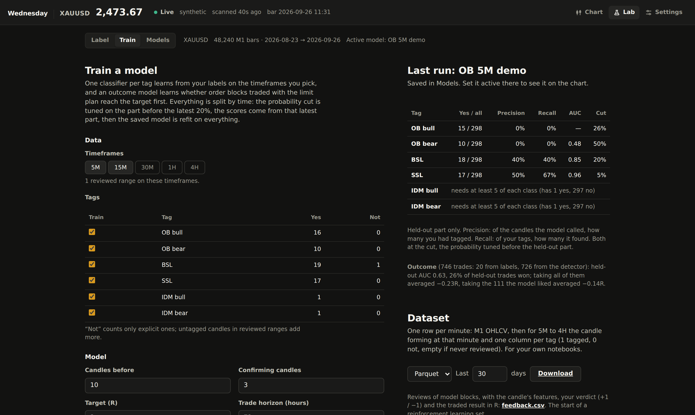
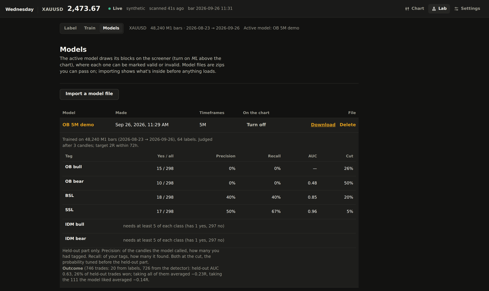
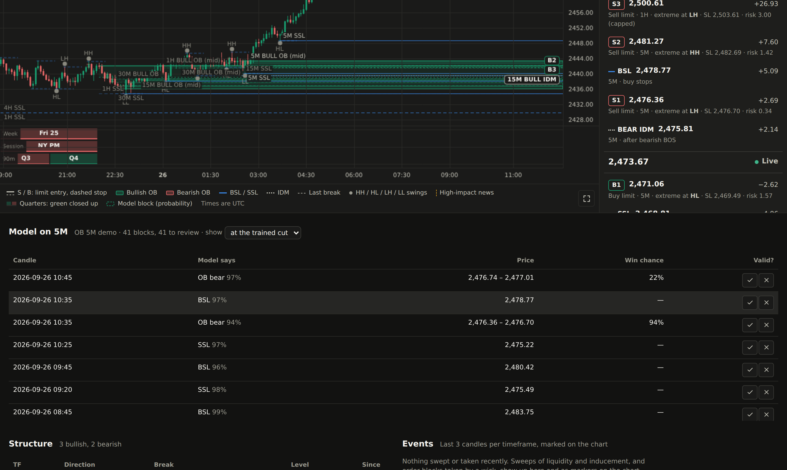

# Lab: labels and models

The Lab is a workbench next to the screener (**Lab** in the top bar). You tag
candles by hand, train models on those tags, and keep model files you can pass
on. The screener stays the production view: it only shows the active model's
blocks, as the **ML** layer, where each one can be marked valid or invalid.

Needs the `ml` extra (`make install` includes it, or `uv sync --extra ml`) and a
database (the default SQLite one is fine). Labelling works without the extra;
training, model files and the Parquet download need it.

## Label

1. Pick a timeframe and page through the history (**Older**, **Newer**, a date,
   **Latest**). The history is the stored M1 bars (the latest 400,000 by
   default, about a year; see [Data](#data)) plus the live buffer.
2. Click a candle to select it. Shift-click, or Shift + arrow keys, selects a
   range (an order block can be more than one candle).
3. Tag it with a button or the number keys: `1` OB bull, `2` OB bear, `3` BSL,
   `4` SSL, `5` IDM bull, `6` IDM bear. Press `N` first to mark it *not* that tag
   instead: the near misses are the most useful examples.
4. **Reviewed ranges**: when you've tagged everything in a stretch, mark it
   reviewed (`R` for the selection, or **Whole page reviewed**). Inside a reviewed
   range, a candle you didn't tag counts as *not* that tag. Outside, candles are
   left out of training rather than guessed as negatives.

The detector's levels show as dotted suggestions; `A` accepts the ones on the
selection. That's quicker than tagging from scratch, but a model trained only on
accepted suggestions just learns the detector back. Fix what it gets wrong.

**Review queue.** With a model active, **Queue** (or `Q`) lists the candles
across the whole history where the model is least sure: a tag's probability
closest to that tag's cut, the closest first. Labels there teach it the most, so
this beats paging through candles it already gets right. `J` / `K` jump to the
next / previous one: the chart stays on its timeframe, selects the candle and only
moves the page when the candle isn't on it. The side panel shows the model's call
(its chance against the cut) and whether the detector found it; tag it with the
usual keys and it leaves the queue. Filter by tag, and by candles inside or
outside reviewed ranges (a range counts for the tags it was reviewed for). The
counter shows how many are left and how many you've done this session. The
scores are computed once per model, timeframe and history (`GET
/api/lab/queue?tf=&tag=&scope=&limit=`), and labels are applied on every call.

**Undo and bulk edits.** `Ctrl+Z` undoes the last tag, *not*, accept, delete or
reviewed range, and `Ctrl+Shift+Z` (or `Ctrl+Y`) redoes it; Cmd on a Mac. An undo
puts rows back exactly as they were, ids included. Under **On the selection**,
**Accept all** takes every suggestion in the selection and **Clear labels**
removes its labels (all, or one tag); both ask first with the count, and both
undo as one step. Every label keeps `updated_at` and what made the last change
(`manual`, `review` or `import`).

A label is saved with its timeframe, tag, the open times of its first and last
candle and, for accepted suggestions, the zone's top and bottom. Labels live in
the `lab_labels` table, reviewed ranges in `lab_reviewed`.

**Labels file.** Under **Train**, **Export labels** downloads every label and
reviewed range of the symbol as one JSON file: a backup, or labels to move to
another machine. **Import labels** shows what the file would change (new,
updated, already here) before anything is written, then merges it: a label with
the same id is updated, the same label under another id is skipped. A file from
another symbol needs a tick to go into this one, and never touches the labels of
the symbol it came from.

## Train

Two kinds of model go into one file:

- **Tag models**, one per tag: "is this candle one?" Trained on your labels only,
  pooled over the timeframes you pick.
- **Outcome model**: "traded with the limit plan (buy at the top of the body, stop
  at the bottom capped at the max stop), does this order block reach the target
  before the stop?" The market answers this one, so it also learns from every
  order block the detector found in the history (you can turn that off).

**Features.** A candle is judged once the confirming candles after it have closed
(3 by default). The model sees, in ATRs: the 10 candles before, the candle, the
confirming candles, where its high and low sit in that window, the hour and
weekday, and the last closed candles of the next two timeframes up. Nothing later.
Each sample records `available_at`, the moment a model could have known.

**Feature families.** Extra groups of features are switched on per model in the
Train form, so their worth can be measured by training with and without them. A
model's file lists the families it was trained with (`params.families`), and
scoring rebuilds exactly those; files from before families build the features
above only.

| Family | What it adds |
| --- | --- |
| Session and quarter | The session (Tokyo, London, NY AM, NY PM), its 90-minute quarter and the trading weekday, all in New York time from the feed's clock, plus how far the candle closed from the week's and the session's open, in ATRs. |
| Structure | The latest break of structure on this timeframe (up or down, BOS or change of character, candles since) and on the next one up, the last swing's label (HH, HL, LH, LL), and the distance to the swing high and low that haven't been broken, in ATRs. Swings use 5 candles each side, like the detectors. |
| Liquidity | Whether a swing high or low was swept (wick through, close back) by one of the last 5 candles, and the distance to the nearest equal highs and lows still standing (two swings within 0.1 ATR). |
| News | Minutes from the candle to the next high-impact USD release and since the last one, from the calendar stored in the database. Release times are published ahead, so the next one is known at the time. Candles outside the stored calendar (more than a week before its first week or after its last) have no value, rather than a wrong one. |
| Bias | The bias you had set when the candle was judged: bullish, bearish or neutral, empty when none was set or it had expired. Wednesday keeps every bias you set from this version on (`bias_history`), so older candles have no value. It only reads your history: the bias is still yours to set. |

Every family is causal. Structure and liquidity describe the market as it stood
when the last confirming candle closed, the moment the sample is judged; a test
rewrites everything after that moment and checks nothing changes. Which families help is
for you to measure: train the same tags with and without one and compare the
fold scores.

**Scores.** Everything is split by time, never at random, by the moment each
sample became known. With a few hundred labels one test window is noisy (a calm
or wild week flatters a model), so by default training runs **4 walk-forward
folds**: the history is cut into five slices in time, and fold *j* trains on
everything before slice *j* and is scored on it (an expanding window). Each
fold tunes its probability cut (best F1) on the latest 20% of its training part.
Between a fold's training part and its test part, `confirm` candles of the
largest timeframe are left out (a purge), so candle windows that overlap can't
leak the answer. The scores show the mean ± spread over the folds, and **Scores
per fold** lists each fold, with the average R per fold for the outcome model.
The saved cut is the latest fold's, the one nearest live data, and the saved
model is refit on everything. **Scored on: One split** gives the older single
split (the latest 20% held out). The folds share the feature tables, so only the
fits repeat.

Precision is how many of the model's calls you had tagged; recall is how many of
your tags it found; both at the cut. AUC doesn't depend on the cut.

For the outcome model the scores add what trading would have made: the average R
of every held-out trade against the average R of the trades the model liked.

**What the model looks at.** A model's scores open a list per tag of the
feature groups it leans on (the candle, the candles before, the confirming
candles, the window high / low, volatility, time of day, higher timeframes,
session and quarter when that family is on, and the zone for the outcome model), with its top features in plain words. It is
permutation importance: how much held-out AUC drops when a group, or one feature,
is shuffled across the held-out candles, measured on the model fit before them.
A model that leans mostly on time of day rather than the candles is worth a
second look. Files from before 0.1.7 don't carry it.

**Stop** ends a run at its next stage (between tags); nothing is saved.
**Recent runs** keeps the last 20 runs with how they ended, errors included, so
a failed run's reason survives a restart (a run cut off by one shows as
*interrupted*).

The classifier is scikit-learn's `HistGradientBoostingClassifier`: quick, fine
with a few hundred labels, and it handles missing context (4H has nothing above
it) on its own.

## Models

Models are saved as zip files in `data/models` (`XAU_MODELS_DIR`):

- `manifest.json`: name, author, note, when and on what it was trained (symbol,
  data source and the clock of its bar times), the timeframes, the scores and
  feature importance per tag, the settings, and the SHA-256 of the pickle.
- `model.pkl`: the fitted estimators.

**Use** sets a model active; the screener's ML layer and the Lab's **Model**
toggle show its blocks. **Download** gives you the file to pass on.

**Compare**: tick two or three models for a side-by-side table of their held-out
scores per tag (labels used, precision, recall, AUC, cut), the outcome model's AUC
and average R, their settings and data ranges, with the best value per row in
bold. When their held-out windows differ the scores aren't strictly comparable,
so **Score on the same window** re-scores them all on the labelled candles known
after the newest model's training data ends, on the timeframes they share, each
at its own cut. None of them trained on those candles; if there are none yet, it
says so, and you label some newer candles first.

**Import** reads only the manifest first and shows it: name, author, date,
timeframes, tags, bar clock, fingerprint. Nothing is loaded until you click **Load model**.
It also warns when the model was trained on another symbol, or on bar times of
another clock (its time-of-day features would be shifted), or when the file
doesn't say which clock.
Loading a pickle can run code, so Wednesday refuses a file whose pickle doesn't
match the manifest's fingerprint, and loads it with an unpickler that accepts
only numpy and scikit-learn classes. Still, load model files only from people
you trust.

## Review on the screener

Turn on **ML** above the chart. The active model's blocks on the chart's
timeframe show as dashed outlines with their probability, and a **Model on 5M**
panel lists them, newest first, with the chance of winning for order blocks.
Hover a row to find it on the chart and see why the model called it; ✓ and ✕ mark
it valid or invalid. The
default shows each tag from its trained cut; the menu shows everything above a
fixed probability instead.

A review does two things:

- It becomes a label (tag yes for valid, *not* for invalid) that the next
  training run learns from.
- It is stored with the market's result: for an order block, the limit plan is
  simulated from when the model called it (`win`, `loss`, `open`, `untouched`,
  and the result in R).

The same buttons are in the Lab (`V` / `X` on the selection).

**Why this block.** Each block names the three feature groups that moved its
probability most, in points: how much lower (or higher) it would be with that
group set to its training median. "Confirming candles +18 pts" means the candles
after it did most of the work. It is a quick local estimate, shown for model
files from 0.1.7 on.

**Live scorecard.** Under the ML panel, and for the active model in **Lab >
Models**, a line says how the model has done since you turned it on:

- **Reviews**: the share of its blocks you marked valid, against its held-out
  precision.
- **Trades**: its order block calls traded with the limit plan (simulated like a
  review), finished ones only, against the held-out average R.
- **Inputs**: volatility (ATR %) and candle bodies on the latest 300 candles of
  each timeframe, against the training history (model files from 0.1.7 on).

A warning appears only after 20 reviews or finished trades, when the result sits
more than two standard errors below what held-out data promised, or when an
input's median is 1.5× (or ⅔) of the training one: "5M ATR is 2.1× what the
model was trained on". It never turns the model off; that stays your call.

## Backtest

**Lab > Backtest** trades every order block the detector finds on the stored
history with the same limit plan the Lab trains on: entry on the body, stop at
the far side capped at the max stop (`XAU_MAX_SL`), target in R, and a horizon
after which an unfinished trade counts as open. It runs through the same
`simulate` code as training, so the outcomes match.

No look-ahead: a trade starts at the close of the candle that broke structure
(when the order block became known), never at the order block candle itself.

Choose the timeframe, an optional date range, the target and horizon, and which
order blocks to trade:

- **All the detector finds.**
- **Model's win chance at least X**: only blocks the active model's outcome part
  rates at or above X. The model's features for a candle are ready a few candles
  later, so these trades start at the later of the break close and that time.
- **Only ones I labelled**: detector blocks covered by a "yes" OB label.

The result shows trades, fill rate, win rate, average R, total R and max
drawdown in R; an equity curve in R (one point per finished trade, at its exit);
the same numbers split by OB priority, swing tag (LH / HH / HL / LL), session and
weekday in New York time (the trading day starts 18:00, as in the quarterly
view) and direction; and the trades, with a running total that is the table
view of the curve. **Download trades (CSV)** exports all of them. Detection is
cached per timeframe and history, so a year of 5M takes a few seconds the first
time and changing the plan or filter after that is quick. The API is `GET
/api/lab/backtest?tf=&from=&to=&rr=&horizon=&filter=&min_win=&format=json|csv`.

Past results on history say nothing certain about future trades.

## Data

**Lab > Data** shows how much M1 history is stored for the running source and
symbol, and adds more. Early on there is little: Yahoo Finance only gives days
of M1, and MT5 only what was fetched since Wednesday started.

- **Stored history**: one row per month, one square per day. Paler squares
  have fewer bars, outlined ones none, grey ones are weekends.
- **Backfill from MT5** (MT5 as the source): pulls older M1 bars from the
  terminal back to a date, five days per call between scans, with progress and
  a Stop button. It stops with a note when the terminal has nothing older:
  raise *Tools > Options > Charts > Max bars in chart* and scroll the M1 chart
  back so the terminal downloads more.
- **Import a file**: M1 bars from an MT5 export (`<DATE> <TIME> <OPEN> ...`,
  UTF-16 is fine), Dukascopy (`Gmt time,...`), HistData ASCII (`20240102
  180000;...` or `2024.01.02,18:00,...`) or any CSV with a time column and
  open, high, low, close. The preview shows the format, range and first rows;
  you confirm the file's clock (Dukascopy UTC, HistData UTC-5, an MT5 export
  the broker's server time) and the times are moved to the feed's clock.
  Importing is an upsert on time, so a file imported twice adds nothing.
  Use prices of the same market as the feed: spot gold for MT5, COMEX
  futures for Yahoo Finance.
- **History the Lab uses**: how many of the latest stored bars are loaded for
  labelling, training and the dataset, up to 2,000,000 (about five years,
  roughly 100 MB of memory).

Imported and backfilled bars also let the chart scroll further back (see
[Scrolling back](data-sources.md#scrolling-back)). Demo data is never stored,
so there is nothing to add to.

## Datasets

**Train > Dataset** downloads the labels as one row per minute (Parquet or CSV,
the last N days):

| Columns | What |
| --- | --- |
| `time`, `open` … `volume` | the M1 bar |
| `m5_time`, `m5_open`, `m5_high`, `m5_low`, `m5_close` | the 5M candle forming at that minute: its open, the high and low so far, the current close. Same for `m15`, `m30`, `h1`, `h4` |
| `m5_ob_bull`, `m5_bsl`, … | the label of that 5M candle: 1 tagged, 0 not, empty if never reviewed. One per timeframe and tag |

The OHLC columns only use data up to that minute; the label columns are the
answer, known afterwards.

**feedback.csv** holds every review: the candle's features (the state), the tag
the model called (the action), your verdict as +1 / −1 and the traded result in
R (two rewards). It's the start of a reinforcement learning set, for training a
policy outside Wednesday.

## Model files for other people

The Lab is the same for everyone: anyone can label and train their own model. A
model file carries everything needed to run it, so you can train one and hand it
to others, who import it and turn it on without labelling anything. The manifest
names the author and the fingerprint lets them check they got the file you made.

The fingerprint only proves the model matches its own manifest: anyone can rebuild
a file with a new model, a matching fingerprint and any author name. A signature
says who made it. Sign your models like this:

1. Make a key once: `wednesday --new-signing-key ~/.wednesday/signing.pem`. It
   writes the private key (readable only by you; never commit it) and prints the
   public key to share.
2. Sign every model you train: set `XAU_SIGNING_KEY=~/.wednesday/signing.pem`
   in `.env`. Or sign an existing file: `wednesday --sign-model model.zip --key
   ~/.wednesday/signing.pem` (`--key` defaults to `XAU_SIGNING_KEY`).
3. People who get your files add your public key in Settings > Lab.

The signature is Ed25519 over the manifest (which carries the model's SHA-256), in
`signature.json` inside the zip. On import the file shows one of:

- **Signed by NAME**: a key you trust (momentum.id's is built in). Loads.
- **Signed by an unknown key** (with its key id): correctly signed, but not by a
  key you trust. Loads only after you tick "I trust this file".
- **Not signed**: the same, tick to load.
- **Signature broken**: the signature or the model doesn't match. Never loads.

"Only load models signed by a trusted key" in Settings > Lab refuses the unknown
and unsigned cases outright. The Models table shows each file's state, and turning
a model on checks its signature again.
